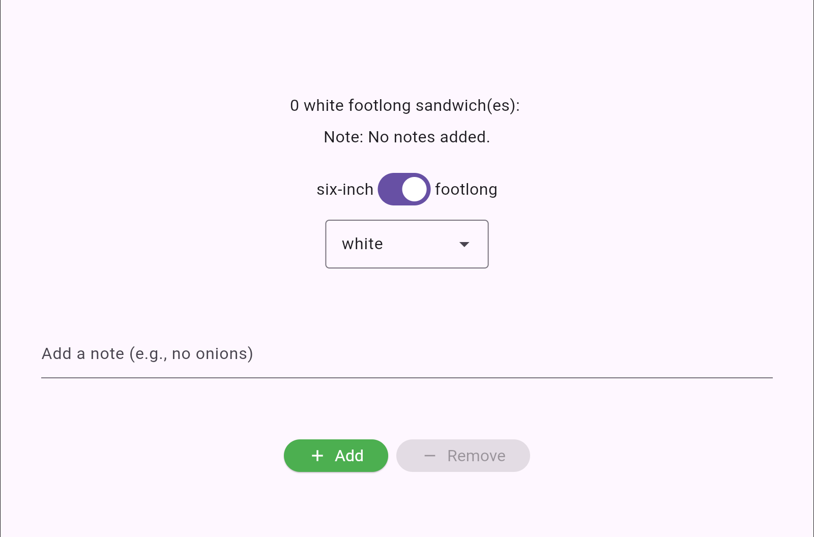

# Sandwich Shop

## Description

A simple Flutter sample app demonstrating a cross-platform "Sandwich Shop" UI and basic stateful widgets for ordering sandwiches.

Briefly, the app lets users:
- Choose bread type
- Increment / decrement sandwich quantity (with a max limit)
- Add a short note for the order
- See an order item display showing quantity, bread, type, emoji for sandwiches, and the note
- Display the total price of the order depending on the sandwich type

Key features
- Order screen with controls: Add / Remove buttons, bread selector, notes text field
- Limit enforcement on minimum (0) and maximum quantity
- Reusable styled button widget and order item display widget
- Widget tests covering UI behaviors (tests located under test/)



# Getting started

Prerequisites:

- Flutter SDK (stable). See flutter.dev for install instructions.
- Platform-specific toolchains:
  - Android: Android SDK and an emulator/device.
  - iOS/macOS: Xcode (macOS only).
  - Windows: Visual Studio with Desktop development with C++ workload.
  - Linux: GTK+ 3 and usual build tools (cmake, gcc, etc).
- CMake (used by desktop runners).

Clone the repository:

```bash
git clone https://your.remote/repo.git sandwich_shop
cd sandwich_shop
```

Install dependencies:

`flutter pub get`

Run the app

Run on the default connected device:

`flutter run`

Choose a specific device:
Android / iOS / web: use flutter devices to list IDs then:
flutter run -d <device-id>
Desktop:
flutter run -d windows
flutter run -d linux
flutter run -d macos
Development notes

Hot reload works as usual:

`flutter run`

Make code changes, then press "r" in the terminal for hot reload

Usage:

Open the app to view the Order screen.
Use "Add" to increment quantity; UI updates to display sandwich emoji for each item (up to the configured max).
Use "Remove" to decrement quantity; it will not go below zero.
Use the bread Dropdown to change bread type (e.g., white, wheat, wholemeal).
Enter a note in the notes TextField (keyed for tests) to attach to the order; the UI shows the note below the order display.
Configuration

Common configuration lives in pubspec.yaml (dependencies, assets).
Platform-specific build configs are in the corresponding platform folders (windows/, linux/, macos/, web/, ios/).
Running tests

Run unit and widget tests:

`flutter test`

Example tests exist under:
test/views/widget_test.dart (widget coverage for order interactions and small reusable widgets)


For further enquiries: up2306587@myport.ac.uk

